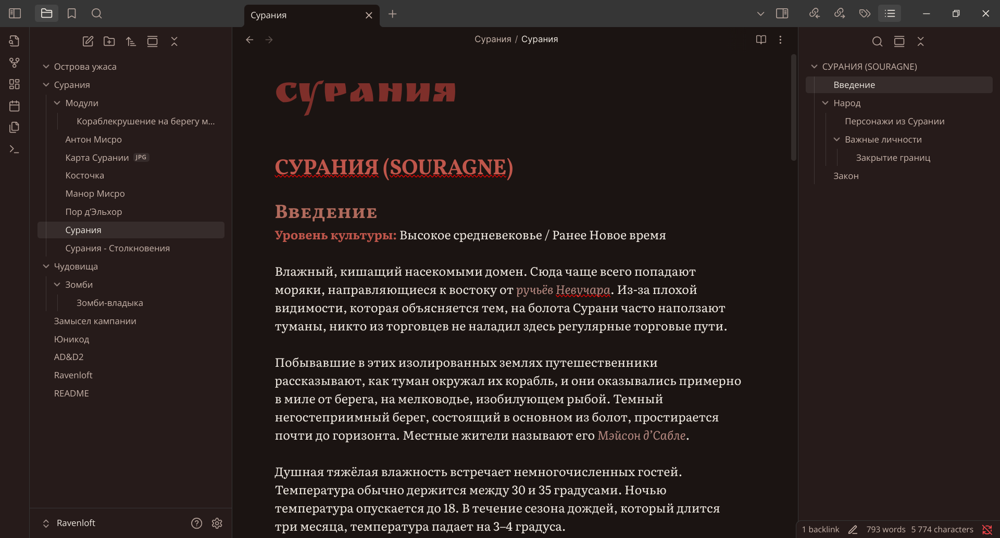
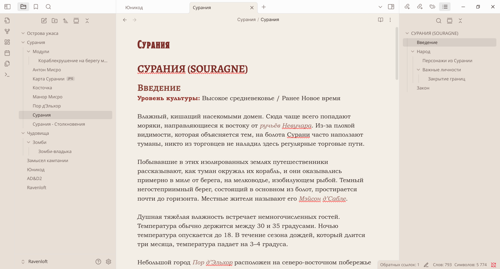

# Ravenloft — A Gothic Parchment Theme for Obsidian.md
*A parchment-warm dual-mode theme inspired by **AD&D 2e Ravenloft**: medieval marginalia, candle-lit libraries and the dread Mists all rolled into one.*

---
## Table of Contents
1. Features
2. Screenshots
3. Requirements
4. Installation
5. Recommended Fonts
6. Versioning & Changelog
7. License

---
## 1. Features
* Carefully matched *Light* (aged parchment) and *Dark* (midnight library) variants;
* Hand-picked text stack (see below) with full Cyrillic & Latin coverage.
* 6-level colour-graded headings, ample whitespace, refined line-height.
* Works out-of-the-box with Obsidian ≥ 1.6 universal search spans.
* Muted gothic reds for accents.
* No CSS snippets needed ... drop it in and write.

---
## 2. Screenshots

  

---
## 3. Requirements
* **Obsidian 1.6.0 or later** (the first version with the new unified search-highlight API).  
* Works on all desktop OSes; mobile has not been extensively tested.

---
## 4. Installation

### 4.1. Community Themes *(preferred)*
1. Settings → *Appearance* → **Manage** → *Browse*.
2. Search for **“Ravenloft”** and click **Install**.
3. Hit **Use** to apply.
### 4.2. Manual
1. Download / clone files into .obsidian/themes/Ravenloft/.
2. Settings → Appearance → Themes → select Ravenloft.

Path to Vault and then:
.obsidian/
└─ themes/
   └─ Ravenloft/
      ├─ manifest.json
      ├─ theme.css
      ├─ preview-light-theme.png
      ├─ preview-dark-theme.png
      ├─ preview.png
      ├─ README.md
      ├─ LICENSE
      ├─ versions.json
      ├─ .stylelintrc.json

---
## 5. Fonts
This theme uses Google Fonts:

* **Open Sans** is for UI https://fonts.google.com/specimen/Open+Sans
* **Literata** is for main text https://fonts.google.com/specimen/Literata
* **Vollkorn SC** is for headings https://fonts.google.com/specimen/Vollkorn+SC
* **Ruslan Display** is for inline filename https://fonts.google.com/specimen/Ruslan+Display

Fonts are imported on-the-fly from *fonts.google.com*; they are **not** bundled with this repository.

---
## 6. Versioning & Changelog
This is version 1.1.0
Complete overhaul of the font stack and minor tweaks and typos in this file.

---
## 7. License
This theme is released under the **MIT License** (see `LICENSE`).
All recommended fonts are distributed under their own libre licenses and are **not** part of this repository; you are responsible for complying with each font’s terms.
### Some License Details
* **AD&D** and **Ravenloft** are trademarks of Wizards of the Coast LLC and Hasbro Inc.

---
* Thanks the Obsidian community for documentation & CSS tricks <3
* Thanks TSR and WotC for the decades of Ravenloft <3

---
Happy writing and... beware the Mists!