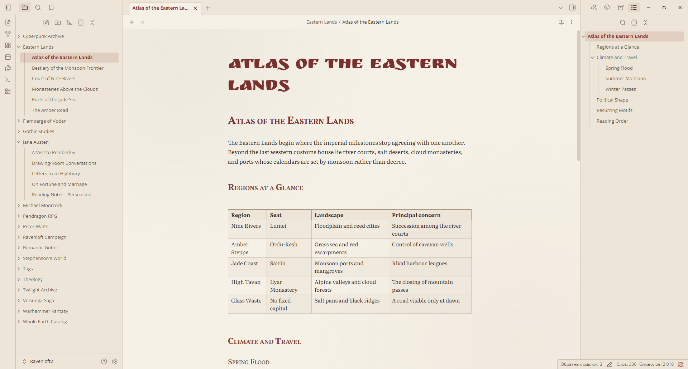
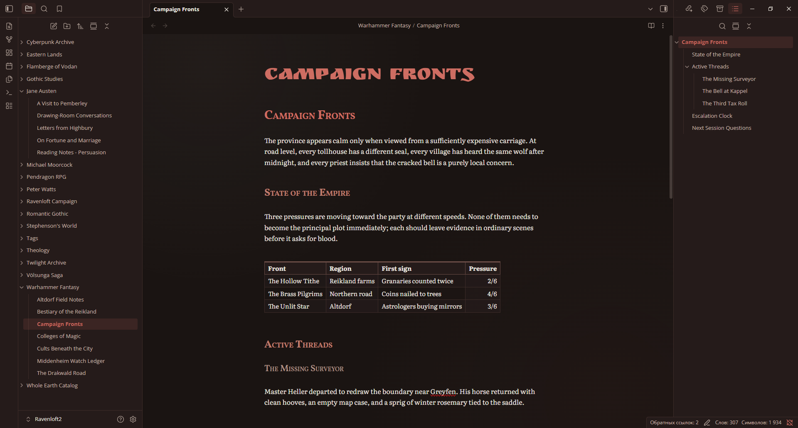

<div align="center">

# Ravenloft

### A parchment-bound gothic theme for Obsidian

**RELEASE 2.0.0 // THE MISTS ARE STILL HERE**

`aged parchment by day` · `midnight library by night` · `Cyrillic + Latin` · `no blood sacrifice required`

</div>

---

> [!WARNING]
> This interface contains candle soot, vagabond narrators, forbidden marginalia, and one more toll of the bell than your heartbeat can account for.

Ravenloft is a dual-mode Obsidian theme inspired by classic gothic role-playing books, medieval marginalia, decaying archives, candle-lit libraries, and the peculiar confidence of a scholar who has just opened the obviously cursed folio.

It aims for atmosphere while sacrificing as little as possible of what themes are actually for: **reading and writing for hours**.

## `2.0.0` — a refactor, not a resurrection spell

The original Ravenloft theme was written against an older Obsidian interface. Its soul was exactly as intended, but too many parts of its skeleton depended on historical DOM structure, legacy CodeMirror selectors, direct component overrides, and deprecated colour machinery.

Version 2.0.0 is a ground-up refactor of the theme.

The visual covenant remains intact:

- warm, aged parchment in Light mode;
- a brown-black midnight library in Dark mode;
- muted blood-red accents rather than neon colour;
- bookish body text, heraldic headings, and a theatrical inline title;
- full Cyrillic and Latin coverage;
- restrained gothic ornament that never wins a fight against legibility.

Under the vellum, however, nearly everything has been rebuilt around modern Obsidian CSS variables.

| Layer | Ravenloft 1.x | Ravenloft 2.0 |
|---|---|---|
| Editor engine | Historical selectors and CodeMirror-era patches | Modern CodeMirror 6-aware styling |
| Colour system | Direct colours and deprecated HSL helpers | Native palette variables and OKLCH colour mixing |
| Interface | Selected components | Semantic coverage across the application |
| Customisation | Edit the CSS and pray | **Style Settings** plugin support |
| Data views | Predates Bases | Native Bases tables and cards |
| Accessibility | Mostly inherited | Contrast mode, reduced motion, mobile and print passes |
| Maintenance | Selector-heavy | Variable-first, low-specificity architecture |

## Field guide to the domain

### Dual-mode palette

- **Aged Parchment** — warm ivory paper, sepia structure, ink-brown text, restrained crimson accents.
- **Midnight Library** — near-black umber surfaces, warm ivory text, ember-red highlights, no cold grey void.
- Six colour-graded heading levels remain distinct without turning a note into a rainbow.
- Selection, highlights, borders, active states, links, tags, and callouts derive from the same semantic palette.

### Typography grimoire

Ravenloft embeds its typefaces directly in `theme.css`. The theme makes no runtime font requests and remains visually intact offline.

| Duty | Typeface | Character sheet |
|---|---|---|
| Long-form reading and editing | **Literata** | Literary serif, Cyrillic and Latin |
| Interface and navigation | **Open Sans** | Quiet, highly legible sans-serif |
| Headings | **Vollkorn SC** | Small-caps authority without ornamental excess |
| Inline note title | **Ruslan Display** | One deliberate flourish at the entrance |

All bundled font files retain their own SIL Open Font License terms. Exact
copyright notices and licence sources are recorded in
[Font licences and attribution](FONT-LICENSES.md).

### Modern Obsidian coverage

The refactor includes deliberate styling for:

- Live Preview and Reading view;
- inline titles and all six heading levels;
- tabs, stacked tabs, title bar, ribbon, status bar, menus and prompts;
- file navigation, search results and active states;
- Properties and metadata;
- links, blockquotes, lists, task checkboxes, tags and embeds;
- inline code, fenced code blocks and syntax tokens;
- Markdown tables;
- callouts;
- modals and form controls;
- native **Bases** table and card views;
- desktop, mobile, reduced-motion and print contexts.

## Style Settings support

[Style Settings](https://github.com/community-archive/obsidian-style-settings) is optional. Ravenloft works without it, but installing the plugin reveals a control panel containing **14 user-facing settings**, with English and Russian labels.

### Colours

- themed accent colour;
- higher-contrast secondary text and borders.

### Typography

- reading font;
- interface font;
- heading font;
- inline-title font;
- text size;
- line height;
- readable line width.

### Atmosphere and focus

- parchment atmosphere: `Plain`, `Subtle`, or `Haunted`;
- optional heading ornaments;
- Focus mode, also exposed as a command;
- comfortable or compact interface density;
- reduced motion.

To find the controls:

1. Install and enable the **Style Settings** community plugin.
2. Open **Settings → Style Settings → Ravenloft**.
3. Adjust the ritual parameters. The Mists will comply within normal CSS cascade latency.

## Ravenloft-themed callouts

Alongside Obsidian's standard callouts, the theme defines two setting-friendly variants.

```markdown
> [!mist] The road is no longer where the map left it
> Every traveller remembers a different milestone.

> [!lore] From the thirteenth folio
> A bell without a clapper still requires a name to ring.
```

- `mist` uses the cyan semantic colour and a fog icon.
- `lore` uses the purple semantic colour and an open-book icon.

## Screenshots

### Aged Parchment



### Midnight Library



## Compatibility matrix

| Component | Status |
|---|---:|
| Minimum Obsidian version | `1.10.6` |
| Primary refactor target | Obsidian `1.13+` |
| Light mode | ✓ |
| Dark mode | ✓ |
| Desktop | ✓ |
| Mobile | ✓ responsive pass |
| Print / PDF | ✓ clean-paper pass |
| Style Settings | ✓ optional |
| Native Bases | ✓ |
| Network connection | Not required |

## Installation

### Community Themes

Ravenloft is available in the Obsidian Community Themes catalogue. Open
**Settings → Appearance → Themes → Manage**, search for `Ravenloft`, then
choose **Install and use**.

### Manual installation

To test a release before the catalogue has picked it up, or to install the
theme without using Community Themes:

1. Download `theme.css` and `manifest.json` from the repository or the latest release assets.
2. Create this folder inside your vault:

   ```text
   .obsidian/themes/Ravenloft/
   ```

3. Place both files in that folder:

   ```text
   Ravenloft/
   ├── manifest.json
   └── theme.css
   ```

4. In Obsidian, open **Settings → Appearance → Themes** and select **Ravenloft**.
5. If the theme was already active, briefly select another theme and switch back, or reload Obsidian.

## Maintenance notes for fellow archivists

Ravenloft 2.0 follows a few strict rules:

```text
prefer semantic variables
    ↓
prefer low-specificity selectors
    ↓
follow Obsidian's component model
    ↓
do not summon !important unless the walls are already bleeding
```

- No JavaScript.
- No telemetry.
- No remote assets required at runtime.
- No `!important` declarations.
- No deprecated `--interactive-accent-hsl` dependency.
- CSS is checked with `stylelint-config-obsidianmd`.
- The Style Settings YAML block is machine-validated.

To run the same CSS quality gate locally (Node.js is needed for development,
not for installing the theme):

```shell
npm install
npm run lint
```

## AI-assisted refactor

Ravenloft 2.0 was rebuilt with **OpenAI Codex** as an AI development assistant working under human direction. This disclosure is included deliberately: software archaeology is still archaeology, even when one of the lantern-bearers is made of matrix multiplication.

Codex was used to:

- research the current Obsidian theme architecture, CSS variables, manifest requirements, and Style Settings format;
- audit the legacy stylesheet and help replace brittle selectors with a variable-first structure;
- implement and check modern component coverage, accessibility states, responsive behaviour, and colour contrast;
- validate the stylesheet, embedded fonts, manifest, and Style Settings metadata.

The original theme, its visual identity, and its design values were created by the author. Creative direction, release decisions, and responsibility for the finished theme remain with the human maintainer.

No AI system, helper script, telemetry, API client, or model runtime is included in Ravenloft. The distributed theme remains exactly what an Obsidian theme should be: CSS, a JSON manifest, locally embedded assets, and so on.

## Version ledger

### `2.0.0` — The Mists Are Still Here

- complete variable-first refactor for modern Obsidian;
- redesigned Light and Dark semantic palettes;
- CodeMirror 6 and modern search styling;
- Style Settings support with bilingual labels;
- native Bases, Properties, tabs, navigation, modal, mobile and print coverage;
- Focus, density, atmosphere, contrast and motion controls;
- custom `mist` and `lore` callouts;
- contrast and maintainability pass;
- all original embedded typefaces preserved.

### `1.1.1` — The Bound Font Edition

- embedded the original font stack into `theme.css`;
- corrected documentation details.

## Licence and provenance

- Theme source code and repository documentation are released under the [MIT License](LICENSE).
- Embedded fonts are distributed under their respective **SIL Open Font License 1.1** terms; see [Font licences and attribution](FONT-LICENSES.md).
- *Ravenloft*, *Dungeons & Dragons*, and related marks belong to their respective rights holders. This is an independent community theme and is not affiliated with or endorsed by Wizards of the Coast or Hasbro.
- *OpenAI*, *Codex*, and related names and marks belong to OpenAI. Their mention acknowledges the AI assistance described above and does not imply sponsorship, affiliation, or endorsement by OpenAI.

## Acknowledgements

- The Obsidian community, whose CSS archaeology saves countless doomed expeditions.
- The authors of Literata, Open Sans, Vollkorn SC, and Ruslan Display.
- Every game master who knows that the handout becomes more suspicious when it is typeset beautifully.

---

<div align="center">

**Write carefully. Cross-link obsessively. Do not answer the thirteenth toll of the bell.**

</div>
