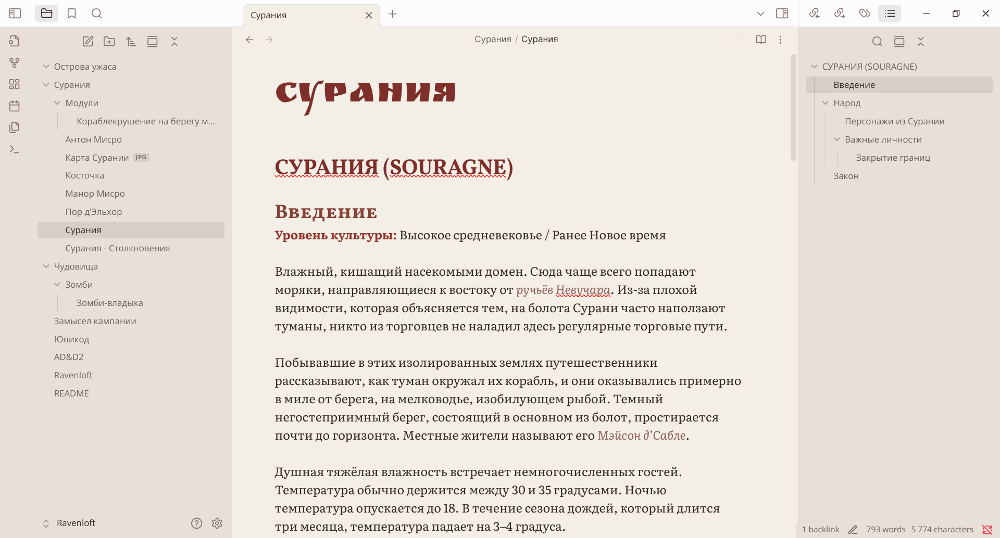

# Ravenloft — A Gothic Parchment Theme for Obsidian.md
*A parchment-warm dual-mode theme inspired by **AD&D 2e Ravenloft**: medieval marginalia, candle-lit libraries and the dread Mists all rolled into one.*

---
## Table of Contents
1. Features
2. Screenshots
3. Requirements
4. Installation
5. Recommended Fonts
6. Versioning & Changelog
7. License

---
## 1. Features
* Carefully matched *Light* (aged parchment) and *Dark* (midnight library) variants;
* Hand-picked text stack (see below) with full Cyrillic & Latin coverage.
* 6-level colour-gradedheadings, ample white-space, refined line-height.
* Works out-of-the-box with Obsidian ≥ 1.6 universal search spans.
* Muted gothic reds for accents.
* No CSS snippets needed ... drop it in and write.

---
## 2. Screenshots

  

---
## 3. Requirements
* **Obsidian ≥ 1.6.0** (the first version with the new unified search-highlight API).  
* Works on all desktop OSes; mobile has not been extensively tested.

---
## 4. Installation

### 1 · Community Themes *(preferred)*
1. Settings → *Appearance* → **Manage** → *Browse*.
2. Search for **“Ravenloft”** and click **Install**.
3. Hit **Use** to apply.
### 2 · Manual
1. Download / clone files into .obsidian/themes/Ravenloft/.
2. Settings → Appearance → Themes → select Ravenloft.

Path to Vault and then:
.obsidian/
└─ themes/
   └─ Ravenloft/
      ├─ manifest.json
      ├─ theme.css
      ├─ preview-light-theme.png
      ├─ preview-dark-theme.png
      └─ (optional) fonts/

---
## 5. Fonts
The theme ships **no font files**. If these families are not installed, the CSS will gracefully fall back to your system serif/sans stacks.

Intended fonts are:

* Font for *UI* is **Open Sans**
* Font for *Body text* is **Mookmania**
* Font for *Headings* is **Alegreya SC**
* Font for *Inline title* is **Nodesto Cyrillic**
### Local-Font Workflow (optional)
1. Create folder:
   /.obsidian/themes/Ravenloft/fonts
2. Drop .ttf files listed above
3. In theme.css uncomment block with three "@font-face" strings, and then save file
4. Reload Obsidian

---
## 6. Versioning & Changelog
This is version 1.0.0

---
## 7. License
This theme is released under the **MIT License** (see `LICENSE`).  
All recommended fonts are distributed under their own libre licenses and are **not** part of this repository; you are responsible for complying with each font’s terms.
### Some License Details
* AD&D and Ravenloft are trademarks of Wizards of the Coast and Hsbro corporations.
* Font designers: Alexei Vanyashin (Nodesto), Juan Pablo del Peral & Huerta Tipográfica (Alegreya), Vernon Adams (Open Sans), Vojtěch Riha (Mookmania).

---
* Thanks the Obsidian community for documentation & CSS tricks <3
* Thanks TSR and WotC for the decades of Ravenloft <3

---
Happy writing and... beware the Mists!